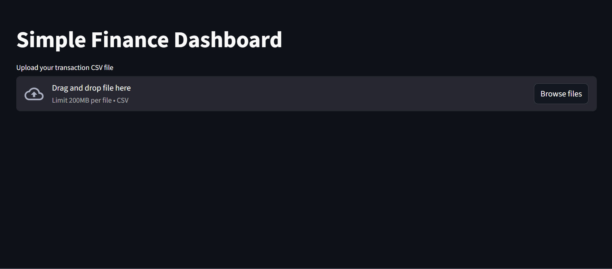
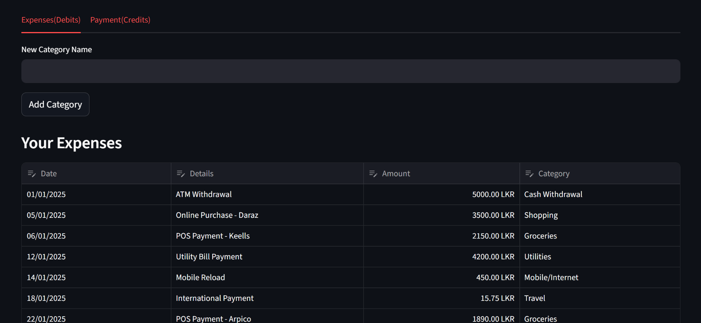
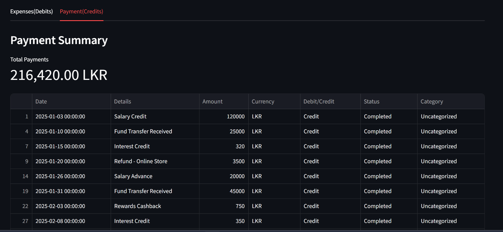

# Simple Finance Dashboard

This project is a **Streamlit-based finance dashboard** that helps you upload your bank transaction CSV file, categorize your expenses, edit categories, and visualize your spending using charts.

---

## Features

### Upload and Read Transaction CSV
Reads your CSV file using **Pandas**, cleans the data, and converts dates and amounts into the correct format.

### Automatic Expense Categorization
A `categories.json` file stores custom categories and keywords.  
The app assigns categories based on transaction **"Details"**.

### Manual Category Editing
You can:  
- Add new categories  
- Assign categories using a table editor  
- Save categorization keywords automatically  

### Expense & Payment Summary
- Total expenses by category  
- Interactive pie chart using **Plotly**  
- Payment totals in a separate tab  

---

## Screenshots

### Dashboard Main View
  

### Expense Tab
  

### Payments Tab
  
---

## Code Explanation

### Imports
```python
import streamlit as st
import pandas as pd
import plotly.express as px
import json
import os
```
- `streamlit` → Builds the UI  
- `pandas` → Reads and processes CSV files  
- `plotly.express` → Creates charts  
- `json` and `os` → Used to save/load category data  

---

### Page Setup
```python
st.set_page_config(page_title="Simple Finance App", layout="wide")
```
Sets the page title and layout to full width.

---

### Category File Handling
```python
categories_file = "categories.json"

if "categories" not in st.session_state:
    st.session_state.categories = {"Uncategorized": []}

if os.path.exists(categories_file):
    with open(categories_file, "r") as f:
        st.session_state.categories = json.load(f)
```
- Creates a default category if not found  
- Stores categories inside `session_state` so it persists while the app runs  
- Loads saved categories from disk  

---

### Save Categories
```python
def save_categories():
    with open(categories_file, "w") as f:
        json.dump(st.session_state.categories, f)
```
Saves updated categories back to `categories.json`.

---

### Automatic Categorization
```python
def categorize_transactions(df):
    df["Category"] = "Uncategorized"
    # Loops through categories and matches transaction "Details" with keywords
```

---

### Load & Clean Uploaded CSV
```python
df = pd.read_csv(file)
df.columns = [col.strip() for col in df.columns]
df["Amount"] = df["Amount"].astype(str).str.replace(",", "").astype(float)
df["Date"] = pd.to_datetime(df["Date"])
```

---

### Add Keyword to Category
```python
def add_keyword_to_category(category, keyword):
    keyword = keyword.strip()
    # Adds the transaction "Details" as a keyword for future auto-categorization
```

---

### Main App UI
```python
uploaded_file = st.file_uploader("Upload your transaction CSV file")
```
Splits data into **Debits** and **Credits**:
```python
debits_df = df[df["Debit/Credit"] == "Debit"]
credits_df = df[df["Debit/Credit"] == "Credit"]
```

---

### Tab 1 — Expenses (Debits)
Add new category:
```python
new_category = st.text_input("New Category Name")
add_button = st.button("Add Category")
```
Edit expense categories:
```python
edited_df = st.data_editor(...)
```
Save changes & update keywords:
```python
if save_button:
    add_keyword_to_category(new_category, details)
```
Expense summary:
```python
category_totals = debits_df.groupby("Category")["Amount"].sum()
fig = px.pie(category_totals, values="Amount", names="Category")
st.plotly_chart(fig)
```

---

### Tab 2 — Payments (Credits)
```python
st.metric("Total Payments", f"{total_payments:,.2f} LKR")
```

---

## Running the App
In your terminal:
```bash
streamlit run app.py
```
Replace `app.py` with your filename.

---

## Conclusion
This Streamlit app provides:  
- Smart transaction categorization  
- Editable categories  
- Visual insights into expenses  
- Simple, beginner-friendly financi